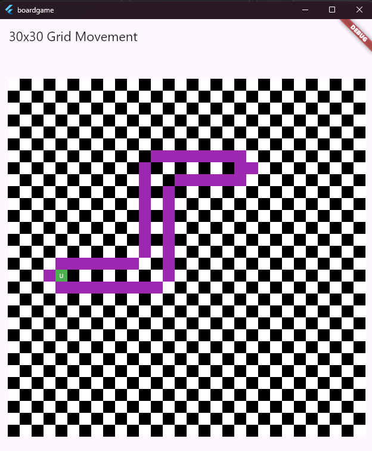

# Experimenting with Small Games and Generative AI

## Project Overview

This project serves as a playground for experimenting with coding small games. It is designed for developers and enthusiasts to explore their creativity and programming skills in game development. Through various coding exercises and challenges, we aim to create engaging and fun mini-games while learning the intricacies of programming.

## The Role of Generative AI in Assisted Programming

Generative AI plays a pivotal role in modern programming, especially in the development of small games. With AI-driven tools, developers can quickly generate code snippets, troubleshoot errors, and explore new programming concepts. By utilizing prompts and contextual assistance, developers can save time and enhance their creativity, allowing them to focus more on game design and mechanics rather than getting bogged down by syntax and structure.

## Types of Games to Experiment With

In this project, you can experiment with a variety of small games, including but not limited to:
- **Puzzle Games**: Challenge players to solve puzzles using logic and strategy.
- **Platformers**: Navigate through levels filled with obstacles and enemies.
- **Arcade Games**: Enjoy fast-paced and engaging gameplay with high score challenges.
- **Card Games**: Play classic and modern card games that require strategy and skill.
- **Interactive Stories**: Experience text-based games that offer choices leading to different outcomes.


## Board Game Description



### 30x30 Grid Movement Game

This project includes a simple board game implemented in Flutter, featuring a 30x30 grid. The player controls a green block ('U') that can move around the grid using arrow keys on a desktop or by tapping adjacent cells on a mobile device. The game includes the following features:

- **Movement**: Use arrow keys or touch input to navigate the grid.
- **Highlighting**: Surrounding cells turn purple when the player moves.
- **Blinking Effect**: Pressing the spacebar or shaking the device causes all white cells to blink green before resetting to their original colors.


## Prerequisites

Before diving into this project, make sure you have the following tools installed:
- **Flutter SDK**: Follow the [official Flutter installation guide](https://flutter.dev/docs/get-started/install) to set up Flutter on your machine.
- **IDE**: Use an Integrated Development Environment like Android Studio or Visual Studio Code with Flutter and Dart plugins installed.
- **Version Control**: Familiarity with Git to manage code versions and collaborations.

## Installation and Setup

To get started with this project, follow these steps:

1. **Clone the Repository**: Use Git to clone the project repository to your local machine.
   ```bash
   git clone https://github.com/yourusername/experimenting-with-small-games.git
   ```

2. **Navigate to Project Folder**: Change into the project directory.
   ```bash
   cd experimenting-with-small-games
   ```

3. **Install Flutter Dependencies**: Run the following command to install all the necessary Flutter packages.
   ```bash
   flutter pub get
   ```

4. **Run the Flutter App**: Use the following command to start the Flutter app. Make sure you have a connected device or emulator running.
   ```bash
   flutter run
   ```

## Examples of Generative AI Assistance

Below are examples of how generative AI can assist in programming small games:
- **Code Generation**: By entering a prompt like 'create a simple platformer game in Python', the AI can generate initial code structures.
- **Debugging Assistance**: If you encounter an error, you can ask the AI, 'Why is my loop not functioning?' and receive suggestions for fixing the issue.
- **Learning Resources**: The AI can provide links to tutorials or documentation based on your current challenges, helping you learn more effectively.


## Contribution Guidelines

We welcome contributions from anyone interested in expanding this project. To contribute:
1. **Fork the Repository**: Click on the fork button at the top right of the repository page.
2. **Create a New Branch**: Make your modifications in a new branch for better organization.
   ```bash
   git checkout -b feature-name
   ```
3. **Make Changes**: Add your code, documentation, or other improvements.
4. **Commit Your Changes**: Once you're satisfied with your changes, commit them.
   ```bash
   git commit -m 'Add some feature'
   ```
5. **Push Your Changes**: Push your branch to your fork.
   ```bash
   git push origin feature-name
   ```
6. **Open a Pull Request**: Go to the original repository and open a pull request.

## License

This project is licensed under the MIT License - see the [LICENSE](LICENSE) file for details.
```

This content is formatted in Markdown and should maintain its formatting when copied into a `.md` file. Let me know if you need any further adjustments!